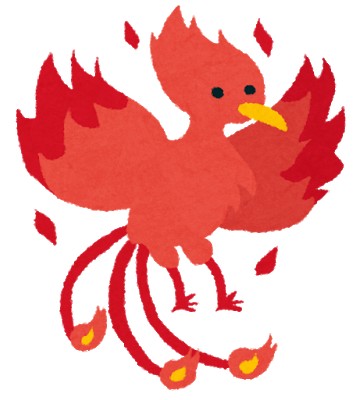
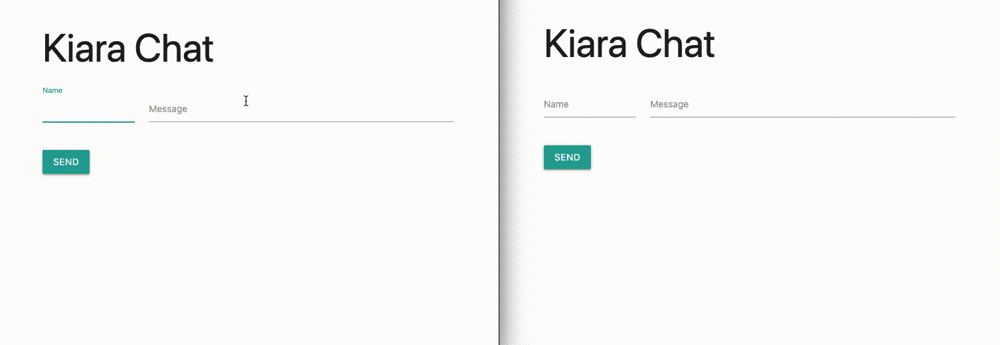

# Kiara


[](https://pkg.go.dev/github.com/genkami/kiara)



Kiara is a Go equivalent of Phoenix PubSub that makes it easy for Go applications to communicate with each other.

## Examples
* [Basic Usage](https://github.com/genkami/kiara/tree/main/examples/basic-usage)
* [Custom Codec (WATSON × Kiara)](https://github.com/genkami/kiara/tree/main/examples/custom-codec)
* [NATS Adapter](https://github.com/genkami/kiara/tree/main/examples/nats-adapter)
* [Chat](https://github.com/genkami/kiara/tree/main/examples/chat)



## Basic Usage (with Redis Backend)

``` go
package main

import (
	"context"
	"fmt"

	"github.com/genkami/kiara"
	adapter "github.com/genkami/kiara/adapter/redis"
	"github.com/go-redis/redis/v8"
)

type Message struct {
	From string
	Body string
}

func main() {
	var err error
	redisClient := redis.NewClient(&redis.Options{Addr: "localhost:6379"})
	pubsub := kiara.NewPubSub(adapter.NewAdapter(redisClient))
	defer pubsub.Close()

	channel := make(chan Message, 5)
	sub, err := pubsub.Subscribe("room:123", channel)
	if err != nil {
		panic(err)
	}
	defer sub.Unsubscribe()

	ctx := context.Background()
	msg := &Message{From: "birb", Body: "cock-a-doodle-doo"}
	err = pubsub.Publish(ctx, "room:123", msg)
	if err != nil {
		panic(err)
	}

	sent := <-channel
	fmt.Printf("%s: %s\n", sent.From, sent.Body)
}
```

## Run Test
To run an entire test, you need to run Redis and NATS, and to tell their addresses to test cases by setting environment variables.

We have `docker-compose.yml` to set up these dependencies easily. To run tests with docker-compose, type these following commands:

```
$ docker-compose up -d
$ export KIARA_TEST_REDIS_ADDR=localhost:6379
$ export KIARA_TEST_NATS_URL=nats://localhost:4222
$ go test ./...
```

## Codec
By default, messages are marshaled into gob format. You can specify which codec Kiara uses to marshal and unmarshal messages by passing `WithCodec()` to `NewPubSub()`.

``` go
import "github.com/genkami/kiara/codec/msgpack"

pubsub := kiara.NewPubSub(
    adapter.NewAdapter(redisClient),
    kiara.WithCodec(msgpack.Codec),
)
```

Currently these codecs are officially available:
* [gob](https://pkg.go.dev/github.com/genkami/kiara/codec/gob)
* [JSON](https://pkg.go.dev/github.com/genkami/kiara/codec/json)
* [MessagePack](https://pkg.go.dev/github.com/genkami/kiara/codec/msgpack)
* [Protocol Buffers](https://pkg.go.dev/github.com/genkami/kiara/codec/proto)

## Custom Codec
You can implement your own codec by simply implementing `Marshal` and `Unmarshal`. For example, if you want to encode messages into [WATSON](https://github.com/genkami/watson), you have to implement WATSON codec like this:

``` go
import 	"github.com/genkami/watson"

type WatsonCodec struct{}

func (_ *WatsonCodec) Marshal(v interface{}) ([]byte, error) {
	return watson.Marshal(v)
}

func (_ *WatsonCodec) Unmarshal(src []byte, v interface{}) error {
	return watson.Unmarshal(src, v)
}
```

## Backend-Agnostic
Kiara does not depend on specific message broker implementation. Currently these message brokers are officially supported:

* [Redis](https://pkg.go.dev/github.com/genkami/kiara/adapter/redis)
* [NATS](https://pkg.go.dev/github.com/genkami/kiara/adapter/nats)

You can change backend message brokers with little effort. Here are examples of connecting to Redis and NATS as a Kiara's backend.

Example(Redis):

``` go
import (
    "github.com/go-redis/redis/v8"
    adapter "github.com/genkami/kiara/adapter/redis"
)
redisClient := redis.NewClient(&redis.Options{Addr: "localhost:6379"})
pubsub := kiara.NewPubSub(adapter.NewAdapter(redisClient))
```

Example(NATS):

``` go
import (
    "github.com/nats-io/nats.go"
    adapter "github.com/genkami/kiara/adapter/nats"
)
conn, err := nats.Connect("nats://localhost:4222")
// error handling omitted
pubsub := kiara.NewPubSub(adapter.NewAdapter(conn))
```

## License

Distributed under the MIT License. See LICENSE for more information.

## Acknowledgements

This library is highly inspired by [phoenixframework/phoenix_pubsub](https://github.com/phoenixframework/phoenix_pubsub), [nats-io/nats.go](https://github.com/nats-io/nats.go), and the majestic phoenix [Takanashi Kiara](https://www.youtube.com/channel/UCHsx4Hqa-1ORjQTh9TYDhww?sub_confirmation=1).
